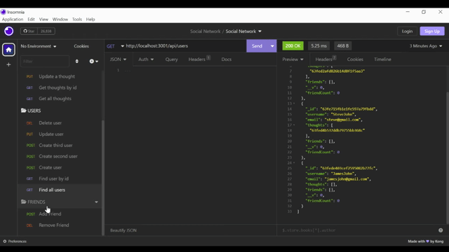
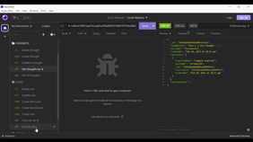
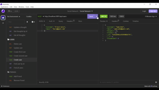

# NoSQL: Social Network API

MongoDB is a popular choice for many social networks due to its speed with large amounts of data and flexibility with unstructured data.

We will be using `Express.js` for routing, a `MongoDB` database, and the `Mongoose` ODM and `moment` to show timestamps. The data seeding is created using Insomnia.

## User Story

```md
AS A social media startup
I WANT an API for my social network that uses a NoSQL database
SO THAT my website can handle large amounts of unstructured data
```

The following animations show the application's API routes being tested in Insomnia.

The following animation shows GET routes to return all users and all thoughts being tested in Insomnia:



The following animation shows GET routes to return a single user and a single thought being tested in Insomnia:



The following animation shows the POST, PUT, and DELETE routes for users being tested in Insomnia:



Here is the walkthrough video demonstrating the application -
[User routes](Assets/USERS.mp4)
[Thoughts routes](Assets/THOUGHTS.mp4)
[reactions and friends routes](Assets/REACTIONS_FRIENDS.mp4)


The URL of the GitHub repository - 

https://github.com/Kaviambi/Social_network_API.git